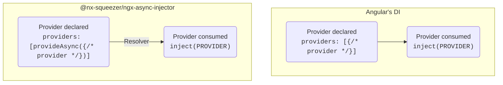

# @nx-squeezer/ngx-async-injector resolver diagram

```mermaid
flowchart TD
  subgraph "Angular's DI"
    ngDeclaration("Provider declared<br><code>providers: [{/* provider */}]</code>") --> ngConsumed("Provider consumed<br><code>inject(PROVIDER)</code>")
  end

  subgraph "@nx-squeezer/ngx-async-injector"
    ngxDeclaration("Provider declared<br><code>providers: [provideAsync({/* provider */})]</code>") --Resolver--> ngxConsumed("Provider consumed<br><code>inject(PROVIDER)</code>")
  end
```
