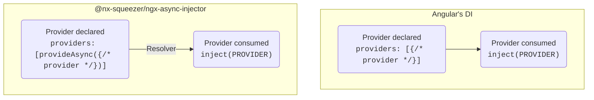

# @nx-squeezer/ngx-async-injector <!-- omit in toc -->

[](https://github.com/nx-squeezer/squeezer/actions/workflows/ci.yml) [](https://www.npmjs.com/package/@nx-squeezer/ngx-async-injector) [](https://github.com/nx-squeezer/squeezer/blob/main/packages/workspace/CHANGELOG.md) [](https://codecov.io/gh/nx-squeezer/squeezer)  

- [Motivation](#motivation)
- [Show me the code](#show-me-the-code)
- [Examples](#examples)
- [Resolve using route's resolver](#resolve-using-routes-resolver)
- [Resolve using a structural directive](#resolve-using-a-structural-directive)

## Motivation

Angular's DI system is designed to be [synchronous](https://github.com/angular/angular/issues/23279#issuecomment-1165030809), since having asynchronous services would make component rendering asynchronous.

When there is a need to load dynamic data when the app is initializing, it is Angular recommends using [`APP_INITIALIZER`](https://angular.io/api/core/APP_INITIALIZER). However, it has several known cons, like delaying rendering the whole component tree or load the routes.

Another common problem is that, when a provider is needed by various features it usually needs to be declared in the root injector, increasing the initial bundle size. It would be great that services could be declared in root, but lazy loaded when needed. It is true that using `providedIn: root` could be used in many scenarios, but there are others where using async `import()` of a dependency would be more useful, such as code splitting and fine grained lazy loading.

For the scenarios described above, having a way to declare asynchronous providers, either by loading data from the server and later instantiating a service, or to lazy load them using `import()`, could help and give flexibility to implementers. This particular problem is what `@nx-squeezer/ngx-async-injector` solves.

## Show me the code

The API that this library offers is very much similar to Angular's DI. Check this code as an example:

```ts
// main.ts
bootstrapApplication(AppComponent, {
  providers: [
    {
      provide: MY_SERVICE,
      useClass: MyService,
    },
  ],
});

// component
class Component {
  private readonly myService = inject(MY_SERVICE);
}
```

Could be made asynchronous and lazy loaded using `provideAsync()`:

```ts
// main.ts
bootstrapApplication(AppComponent, {
  providers: [
    provideAsync({
      provide: MY_SERVICE,
      useAsyncClass: () => import('./my-service').then((x) => x.MyService),
    }),
  ],
});

// component
class Component {
  private readonly myService = inject(MY_SERVICE);
}
```

That's it! Declaration is almost identical, and consumption is the same. But wait, when is the async provided actually loaded and resolved?

It needs another piece that triggers it: resolvers. Check this diagram:



Async providers need to be resolved before being used, and that is a responsibility of the application. It can be done while loading a route using a [route resolver](#resolve-using-routes-resolver), or with a [structural directive](#resolve-using-a-structural-directive) that will delay rendering until they are loaded.

## Examples

## Resolve using route's resolver

```ts
export const appRoutes: Route[] = [
  {
    path: '',
    loadComponent: () => import('./route.component'),
    resolve: {
      asyncProviders: () => resolveMany(MY_SERVICE),
    },
  },
];
```

In this case, the async provider will be resolved while the route loads, and the inside the component `MY_SERVICE` can be injected.

## Resolve using a structural directive

```ts
@Component({
  imports: [ResolveAsyncProvidersDirective, ChildComponent],
  template: ` <child-component *ngxResolveAsyncProviders="{ myService: MY_SERVICE }" /> `,
  standalone: true,
})
export default class ParentComponent {
  readonly MY_SERVICE = MY_SERVICE;
}
```

In this case, the async provider will be resolved when the parent component renders, and once completed the child component will be rendered having `MY_SERVICE` available.

# API

# Installation
