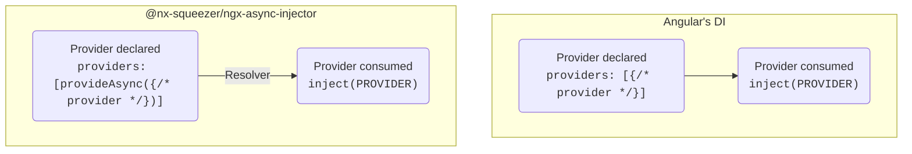

# @nx-squeezer/ngx-async-injector <!-- omit in toc -->

[](https://github.com/nx-squeezer/squeezer/actions/workflows/ci.yml) [](https://www.npmjs.com/package/@nx-squeezer/ngx-async-injector) [](https://github.com/nx-squeezer/squeezer/blob/main/packages/workspace/CHANGELOG.md) [](https://codecov.io/gh/nx-squeezer/squeezer)  

- [Motivation](#motivation)
- [Show me the code](#show-me-the-code)
- [Examples](#examples)
  - [Resolve using route's resolver](#resolve-using-routes-resolver)
  - [Resolve using a structural directive](#resolve-using-a-structural-directive)
- [API documentation](#api-documentation)
  - [`provideAsync` function](#provideasync-function)
  - [`resolve` and `resolveMany`](#resolve-and-resolvemany)
  - [`*ngxResolveAsyncProviders` structural directive](#ngxresolveasyncproviders-structural-directive)
- [Installation](#installation)

## Motivation

Angular's dependency injection (DI) system is designed to be [synchronous](https://github.com/angular/angular/issues/23279#issuecomment-1165030809), since having asynchronous providers would make component rendering asynchronous and break existing renderer.

As of today it is not possible to lazy load data asynchronously and consume it through a provider. The only option recommended by Angular when it needs to be loaded before the app initializes is using [`APP_INITIALIZER`](https://angular.io/api/core/APP_INITIALIZER). However, it has several known cons because it is blocking and delays rendering the whole component tree and loading routes.

Another common problem is the initial payload of the main bundle caused by needing to declare providers in root. When a provider is needed by various features it usually needs to be declared in the root injector, increasing the initial bundle size. It would be great that services could be declared in the root component, but lazy loaded when needed. It is true that using `providedIn: root` could be used in many scenarios, but there are others where using async `import()` of a dependency would be more useful, such as code splitting and fine grained lazy loading.

For the scenarios described above, having a way to declare asynchronous providers, either by loading data from the server and later instantiating a service, or to lazy load them using `import()`, could help and give flexibility to implementers. This particular problem is what `@nx-squeezer/ngx-async-injector` solves.

## Show me the code

The API that this library offers is very much similar to Angular's DI. Check this code as an example:

```ts
// main.ts
bootstrapApplication(AppComponent, {
  providers: [
    {
      provide: MY_SERVICE,
      useClass: MyService,
    },
  ],
});

// component
class Component {
  private readonly myService = inject(MY_SERVICE);
}
```

Could be made asynchronous and lazy loaded using `provideAsync()`:

```ts
// main.ts
bootstrapApplication(AppComponent, {
  providers: [
    provideAsync({
      provide: MY_SERVICE,
      useAsyncClass: () => import('./my-service').then((x) => x.MyService),
    }),
  ],
});

// component
class Component {
  private readonly myService = inject(MY_SERVICE);
}
```

That's it! Declaration is almost identical, and consumption is the same. But wait, when is the async provided actually loaded and resolved?

It needs another piece that triggers it: async provider resolvers. Check this diagram:



Async providers need to be resolved before being used, and that is a responsibility of the application. It can be done while loading a route using a [route resolver](#resolve-using-routes-resolver), or with a [structural directive](#resolve-using-a-structural-directive) that will delay rendering until they are loaded.

## Examples

### Resolve using route's resolver

```ts
export const appRoutes: Route[] = [
  {
    path: '',
    loadComponent: () => import('./route.component'),
    resolve: {
      asyncProviders: () => resolveMany(MY_SERVICE),
    },
  },
];
```

In this case, the async provider will be resolved while the route loads, and the inside the component `MY_SERVICE` can be injected.

### Resolve using a structural directive

```ts
@Component({
  imports: [ResolveAsyncProvidersDirective, ChildComponent],
  template: ` <child-component *ngxResolveAsyncProviders="{ myService: MY_SERVICE }" /> `,
  standalone: true,
})
export default class ParentComponent {
  readonly MY_SERVICE = MY_SERVICE;
}
```

In this case, the async provider will be resolved when the parent component renders, and once completed the child component will be rendered having `MY_SERVICE` available.

## API documentation

### [`provideAsync`](https://github.com/nx-squeezer/squeezer/blob/main/packages/ngx-async-injector/src/lib/providers/provide-async.function.ts) function

It is used to declare one or more async providers. For each provider, it requires the token, and then an async function that can be `useAsyncValue`, `useAsyncClass` or `useAsyncFactory`. It supports `multi` providers as well. It can be used in environment injectors, modules, components and directives. If multiple providers need to be declared in the same injector, use a single `provideAsync` function with multiple providers instead of using it multiple times.

Async provider tokens are regular Angular [injection tokens](https://angular.io/api/core/InjectionToken) typed with the resolved value of the async provider.

Example of declaring a single async provider:

```ts
export const MY_SERVICE = new InjectionToken<MyService>('my-service-token');

bootstrapApplication(AppComponent, {
  providers: [
    provideAsync({
      provide: MY_SERVICE,
      useAsyncClass: () => import('./my-service').then((x) => x.MyService),
    }),
  ],
});
```

Example of declaring multiple providers, each one with different async functions:

```ts
bootstrapApplication(AppComponent, {
  providers: [
    provideAsync(
      {
        provide: CLASS_PROVIDER,
        useAsyncClass: () => import('./first-service').then((x) => x.FirstService),
      },
      {
        provide: VALUE_PROVIDER,
        useAsyncValue: () => import('./value').then((x) => x.value),
      },
      {
        provide: FACTORY_PROVIDER,
        useAsyncFactory: () => import('./factory').then((x) => x.providerFactory),
      }
    ),
  ],
});

// first-service.ts
export class FirstService {}

// value.ts
export const value = 'value';

// factory.ts
export async function providerFactory() {
  return await Promise.resolve('value');
}
```

Multi providers can also be declared as it happens with Angular:

```ts
bootstrapApplication(AppComponent, {
  providers: [
    provideAsync(
      {
        provide: VALUE_PROVIDER,
        useAsyncValue: () => import('./first-value').then((x) => x.value),
        multi: true,
      },
      {
        provide: VALUE_PROVIDER,
        useAsyncValue: () => import('./second-value').then((x) => x.value),
        multi: true,
      }
    ),
  ],
});
```

Finally, the lazy load behavior can be controlled by the `mode` flag. By default it is `lazy`, which means it won't be resolved until requested. `eager` on the contrary will trigger the load on declaration, even though resolvers are still needed to wait for completion. Example:

```ts
bootstrapApplication(AppComponent, {
  providers: [
    provideAsync({
      provide: VALUE_PROVIDER,
      useAsyncValue: () => import('./first-value').then((x) => x.value),
      mode: 'eager',
    }),
  ],
});
```

When using a factory provider, the function itself can be async. Regular [`inject`](https://angular.io/api/core/inject) function from Angular can be used before executing any async code since the injection context is preserved, however it can't be used afterwards. To solve that problem, and also to protect against cyclic dependencies between async providers, the factory provider function is called with a context that exposes two functions that are self explanatory, `inject` and `resolve`. Example:

```ts
import { InjectionContext } from '@nx-squeezer/ngx-async-injector';

export async function providerFactory({ inject, resolve }: InjectionContext): Promise<string> {
  const firstString = await resolve(FIRST_INJECTION_TOKEN);
  const secondString = inject(SECOND_INJECTION_TOKEN);
  return `${firstString} ${secondString}`;
}
```

### [`resolve`](https://github.com/nx-squeezer/squeezer/blob/main/packages/ngx-async-injector/src/lib/functions/resolve.ts) and [`resolveMany`](https://github.com/nx-squeezer/squeezer/blob/main/packages/ngx-async-injector/src/lib/functions/resolve-many.ts)

[`resolve`](https://github.com/nx-squeezer/squeezer/blob/main/packages/ngx-async-injector/src/lib/functions/resolve.ts) and [`resolveMany`](https://github.com/nx-squeezer/squeezer/blob/main/packages/ngx-async-injector/src/lib/functions/resolve-many.ts) functions can be used in route resolvers to ensure that certain async providers are resolved before a route loads. They could be used in other places as needed, since they return a promise that resolves when the async provider is resolved and returns its value. It can be compared to Angular's [`inject`](https://angular.io/api/core/inject) function, but for async providers.

Example of how to use it in a route resolver:

```ts
export const routes: Route[] = [
  {
    path: '',
    loadComponent: () => import('./route.component'),
    providers: [
      provideAsync(
        {
          provide: CLASS_PROVIDER,
          useAsyncClass: () => import('./first-service').then((x) => x.FirstService),
        },
        {
          provide: VALUE_PROVIDER,
          useAsyncValue: () => import('./value').then((x) => x.value),
        }
      ),
    ],
    resolve: {
      asyncProviders: () => resolveMany(CLASS_PROVIDER, VALUE_PROVIDER),
    },
  },
];
```

### [`*ngxResolveAsyncProviders`](https://github.com/nx-squeezer/squeezer/blob/main/packages/ngx-async-injector/src/lib/directives/resolve-async-providers.directive.ts) structural directive

This directive can be used to render a template after certain async providers have resolved. It can be useful to delay loading them as much as possible. The template can safely inject those resolved async providers.

When no parameters are passed, it will load _all_ async injectors in the injector hierarchy:

```ts
@Component({
  template: `<child-component *ngxResolveAsyncProviders></child-component>`,
  providers: [provideAsync({ provide: STRING_INJECTOR_TOKEN, useAsyncValue: stringAsyncFactory })],
  imports: [ResolveAsyncProvidersDirective, ChildComponent],
  standalone: true,
  changeDetection: ChangeDetectionStrategy.OnPush,
})
class ParentComponent {}

@Component({
  selector: 'child-component',
  template: `Async injector value: {{ injectedText }}`,
  standalone: true,
  changeDetection: ChangeDetectionStrategy.OnPush,
})
class ChildComponent {
  readonly injectedText = inject(STRING_INJECTOR_TOKEN);
}
```

Additionally, it also supports a map of async provider tokens. Only those will be resolved instead of _all_. The resolved async providers are available as the context for the structural directive. Example:

```ts
@Component({
  template: `
    <!-- Use $implicit context from the structural directive, it is type safe -->
    <child-component
      *ngxResolveAsyncProviders="{ stringValue: stringInjectionToken }; let providers"
      [inputText]="providers.stringValue"
    ></child-component>

    <!-- Use the key from the context, it is type safe as well -->
    <child-component
      *ngxResolveAsyncProviders="{ stringValue: stringInjectionToken }; stringValue as stringValue"
      [inputText]="stringValue"
    ></child-component>
  `,
  providers: [provideAsync({ provide: STRING_INJECTOR_TOKEN, useAsyncValue: stringAsyncFactory })],
  imports: [ResolveAsyncProvidersDirective, ChildComponent],
  standalone: true,
  changeDetection: ChangeDetectionStrategy.OnPush,
})
class ParentComponent {
  readonly stringInjectionToken = STRING_INJECTOR_TOKEN;
}

@Component({
  selector: 'child-component',
  template: `Async injector value: {{ inputText }}`,
  standalone: true,
  changeDetection: ChangeDetectionStrategy.OnPush,
})
class ChildComponent {
  @Input() inputText!: string;
}
```

## Installation

Do you like this library? Go ahead and use it! It is production ready, with 100% code coverage, protected by integration tests, and uses semantic versioning. To install it:

```shell
npm install @nx-squeezer/ngx-async-injector
```
